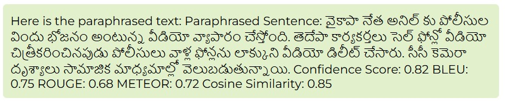
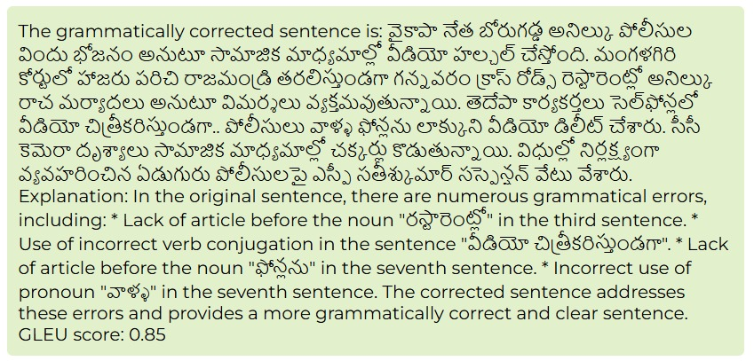

# TeluguQuillBot

- output images of the project

 

## Available Scripts

In the project directory, you can run:

### `npm start`

Runs the app in the development mode.\
Open [http://localhost:3000](http://localhost:3000) to view it in your browser.

The page will reload when you make changes.\
You may also see any lint errors in the console.

You will be directed to [http://localhost:3000/login](http://localhost:3000/login) page.\
The signIn page is dummy page. You can proceed by typing in dummy details and click signIn. 

This will redirect you to [http://localhost:3000/home](http://localhost:3000/home) page. If not open manually.\
We created a chatbot to handle quillbot requests.

The bot handles two requests 
- Paraphrasing
- Grammar correction

### Run python file to activate bot

Run python file `model.py` seperately in other terminal.\

### Getting results

- **Paraphrase :** - Paraphrase : "Enter Text"
- **Error Correction :** - Paraphrase : "Enter Text"

Check output images for more clarity.

